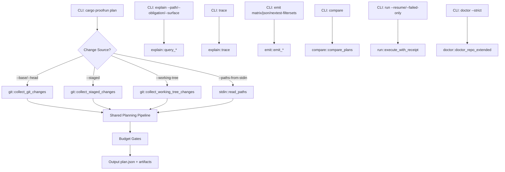
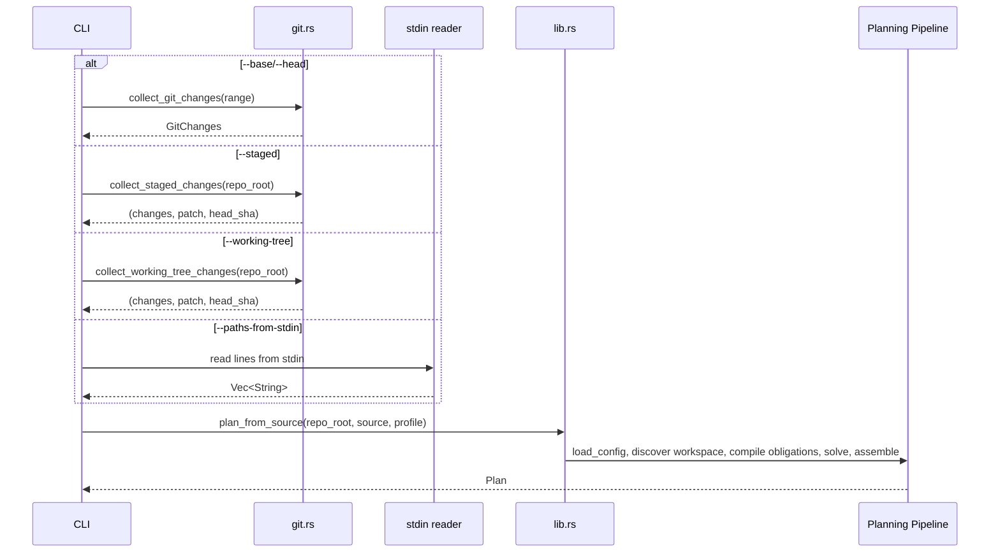

# Design Document: Proofrun Differentiation Features

## Overview

This design covers six feature areas that extend the existing proofrun planning library and CLI without altering the plan.json or receipt.json artifact shapes, without introducing new config schema semantics, and without weakening fail-closed behavior.

The features fall into three categories:

1. **New change sources** (R1–R4): `--staged`, `--working-tree`, `--paths-from-stdin` extend the planner's input beyond committed Git ranges. These reuse the existing obligation compiler, solver, and emitter pipeline — only the change collection step differs.

2. **New query/emit commands** (R5–R11, R20–R24, R27): `explain --path/--obligation/--surface`, `trace`, `emit matrix/json/nextest-filtersets`, `compare`, and budget gates. These are read-only projections over existing Plan data or simple threshold checks applied post-planning.

3. **Enhanced doctor and execution** (R12–R19, R25–R26): Extended doctor diagnostics (duplicate surfaces, uncovered obligations, unreachable rules, unbound placeholders, missing tools, strict mode), run resume, and run failed-only. These add new analysis passes over Config and new execution modes over Receipt data.

### Key Design Decisions

1. **Change source abstraction**: Rather than threading `--staged`/`--working-tree`/`--paths-from-stdin` through the entire pipeline, we introduce a `ChangeSource` enum that resolves to `(Vec<ChangedPath>, patch: String, base: String, head: String, merge_base: String)` before entering the shared planning pipeline. The existing `plan_repo` function gains a new entry point `plan_from_source` that accepts a `ChangeSource` instead of a `GitRange`.

2. **Explain engine as pure queries over Plan**: All explain/trace commands operate on a deserialized `Plan` struct loaded from `plan.json`. No re-planning is needed. The explain module gains new functions that return structured JSON-serializable types.

3. **Doctor findings as typed structs**: The current `DoctorReport.issues` is `Vec<String>`. We introduce `DoctorFinding { severity, message, code }` to support `--strict` mode (exit code 1 on any `error`-severity finding). The existing string-based issues are migrated to findings with severity `warning`.

4. **Resume/failed-only via Receipt merging**: The execution engine loads a previous Receipt, partitions steps into keep/re-execute based on exit codes, runs the re-execute set, and merges results into a new Receipt. Plan digest verification gates the operation.

5. **Plan comparison as a pure function**: `compare(old_plan, new_plan) -> PlanComparison` computes set differences on obligation ids and surface ids, cost delta, and fallback introduction. No side effects.

6. **Budget gates as post-plan checks**: Budget gates (`--max-cost`, `--max-surfaces`, `--fail-on-fallback`, `--warn-on-workspace-smoke-only`) are applied after plan assembly in the CLI layer. The plan is always emitted to stdout; the exit code reflects gate results.

## Architecture

### Extended Pipeline



### New Module Responsibilities

| Module | New Responsibility |
|---|---|
| `git.rs` | `collect_staged_changes`, `collect_working_tree_changes`, `head_sha` |
| `explain.rs` | `query_path`, `query_obligation`, `query_surface`, `trace_plan` — structured JSON output |
| `emit.rs` | `emit_matrix_json`, `emit_structured_json`, `emit_nextest_filtersets` |
| `compare.rs` | NEW — `compare_plans(old, new) -> PlanComparison` |
| `doctor.rs` | Extended checks: duplicate surfaces, uncovered obligations, unreachable rules, unbound placeholders, missing tools; `DoctorFinding` with severity |
| `run.rs` | `execute_with_resume`, `execute_failed_only` — Receipt-aware execution |
| `lib.rs` | `plan_from_source(repo_root, source, profile)` — new entry point |
| `main.rs` | Extended CLI: new subcommands, budget gate flags, change source flags |

### Data Flow for Change Sources



## Components and Interfaces

### `git.rs` — Extended Git Adapter

New functions alongside existing `collect_git_changes`:

```rust
/// Get the current HEAD commit SHA.
pub fn head_sha(repo_root: &Utf8Path) -> Result<String>;

/// Collect staged (indexed) changes: paths from `git diff --name-status --cached`,
/// patch from `git diff --cached --binary`.
pub fn collect_staged_changes(repo_root: &Utf8Path) -> Result<GitChanges>;

/// Collect working tree changes: paths from `git diff --name-status HEAD`,
/// patch from `git diff HEAD --binary`.
pub fn collect_working_tree_changes(repo_root: &Utf8Path) -> Result<GitChanges>;
```

Both functions reuse `parse_name_status_line` for parsing. They set `merge_base` to the current HEAD SHA. `collect_staged_changes` sets `base = HEAD_SHA, head = "STAGED"`. `collect_working_tree_changes` sets `base = HEAD_SHA, head = "WORKING_TREE"`.

### `lib.rs` — Change Source Abstraction

```rust
/// Describes how changed paths are provided to the planner.
pub enum ChangeSource {
    /// Traditional Git range: --base and --head revisions.
    GitRange(GitRange),
    /// Staged changes: git diff --cached.
    Staged,
    /// Working tree changes: git diff HEAD.
    WorkingTree,
    /// Explicit paths from stdin, each treated as status "M".
    PathsFromStdin(Vec<String>),
}

/// Plan a repo from any change source.
pub fn plan_from_source(
    repo_root: &Utf8Path,
    source: ChangeSource,
    profile: &str,
) -> Result<Plan>;
```

`plan_from_source` resolves the `ChangeSource` into `(Vec<ChangedPath>, patch, base, head, merge_base)` then feeds into the existing pipeline (load config, discover workspace, compile obligations, build candidates, solve, assemble plan).

For `PathsFromStdin`: each path becomes `ChangedPath { path, status: "M", owner: None }`. `base = "STDIN"`, `head = "STDIN"`, `merge_base = "STDIN"`, `patch = ""`. Blank lines are skipped, paths are trimmed.

### `explain.rs` — Structured Query Engine

New functions returning JSON-serializable structs:

```rust
/// Result of querying a path's traceability.
#[derive(Serialize)]
pub struct PathExplanation {
    pub path: String,
    pub found: bool,
    pub rule_matches: Vec<RuleMatch>,
    pub obligations: Vec<String>,
    pub surfaces: Vec<String>,
}

#[derive(Serialize)]
pub struct RuleMatch {
    pub rule_index: usize,
    pub pattern: String,
    pub obligations: Vec<String>,
}

/// Result of querying an obligation's traceability.
#[derive(Serialize)]
pub struct ObligationExplanation {
    pub obligation_id: String,
    pub reasons: Vec<ObligationReason>,
    pub selected_surfaces: Vec<String>,
    pub omitted_surfaces: Vec<String>,
}

/// Result of querying a surface's details.
#[derive(Serialize)]
pub struct SurfaceExplanation {
    pub surface_id: String,
    pub status: String, // "selected" or "omitted"
    pub template: Option<String>,
    pub cost: Option<f64>,
    pub covers: Option<Vec<String>>,
    pub run: Option<Vec<String>>,
    pub omission_reason: Option<String>,
}

/// Full traceability chain.
#[derive(Serialize)]
pub struct TraceOutput {
    pub paths: Vec<PathTrace>,
    pub profile_obligations: Vec<ProfileObligation>,
    pub fallback_obligations: Vec<FallbackObligation>,
}

#[derive(Serialize)]
pub struct PathTrace {
    pub path: String,
    pub status: String,
    pub owner: Option<String>,
    pub rule_matches: Vec<RuleMatch>,
    pub obligations: Vec<String>,
    pub surfaces: Vec<String>,
}

#[derive(Serialize)]
pub struct ProfileObligation {
    pub obligation_id: String,
    pub source: String,
    pub surfaces: Vec<String>,
}

#[derive(Serialize)]
pub struct FallbackObligation {
    pub obligation_id: String,
    pub source: String,
    pub surfaces: Vec<String>,
}

pub fn query_path(plan: &Plan, path: &str) -> PathExplanation;
pub fn query_obligation(plan: &Plan, obligation_id: &str) -> Result<ObligationExplanation>;
pub fn query_surface(plan: &Plan, surface_id: &str) -> Result<SurfaceExplanation>;
pub fn trace_plan(plan: &Plan) -> TraceOutput;
```

All query functions are pure reads over the Plan struct. `query_obligation` and `query_surface` return `Err` when the id is not found.

### `emit.rs` — New Emitters

```rust
/// A single entry in the CI matrix output.
#[derive(Serialize)]
pub struct MatrixEntry {
    pub id: String,
    pub template: String,
    pub cost: f64,
    pub covers: Vec<String>,
    pub run: String, // shell-escaped command string
}

/// Emit selected surfaces as a JSON array for CI matrix strategy.
pub fn emit_matrix_json(plan: &Plan) -> String;

/// Emit structured JSON with selected/omitted surfaces, obligations, and metadata.
pub fn emit_structured_json(plan: &Plan) -> String;

/// Emit nextest filterset expressions for surfaces with -E arguments.
pub fn emit_nextest_filtersets(plan: &Plan) -> String;
```

`emit_matrix_json`: builds `Vec<MatrixEntry>` sorted by id, serializes with 2-space indent + trailing newline. Empty plan → `[]`.

`emit_structured_json`: builds a JSON object with `selected_surfaces`, `omitted_surfaces`, `obligations`, `base`, `head`, `merge_base`, `profile`, `plan_digest`. Serialized through `serde_json::Value` for sorted keys, 2-space indent, trailing newline.

`emit_nextest_filtersets`: iterates selected surfaces sorted by id, finds `-E` in run args, prints `{id}\t{expression}\n`. Surfaces without `-E` are omitted.

### `compare.rs` — Plan Comparator (NEW)

```rust
#[derive(Serialize)]
pub struct PlanComparison {
    pub obligations_added: Vec<String>,
    pub obligations_removed: Vec<String>,
    pub surfaces_added: Vec<String>,
    pub surfaces_removed: Vec<String>,
    pub cost_delta: f64,
    pub new_fallback_obligations: bool,
}

/// Compare two plans and compute structural differences.
pub fn compare_plans(old: &Plan, new: &Plan) -> PlanComparison;
```

Pure function. Uses `BTreeSet` for set operations on obligation ids and surface ids. Cost delta = new total cost - old total cost. `new_fallback_obligations` checks if any obligation reason in the new plan has source `unknown-fallback` or `empty-range-fallback` that wasn't present in the old plan.

### `doctor.rs` — Extended Diagnostics

```rust
#[derive(Debug, Clone, Serialize, Deserialize)]
pub struct DoctorFinding {
    pub severity: String,  // "error" or "warning"
    pub code: String,      // e.g. "duplicate-surface-id", "uncovered-obligation"
    pub message: String,
}

#[derive(Debug, Clone, Serialize, Deserialize)]
pub struct ExtendedDoctorReport {
    pub repo_root: String,
    pub config_path: String,
    pub cargo_manifest_path: String,
    pub package_count: usize,
    pub packages: Vec<String>,
    pub issues: Vec<String>,       // backward compat: existing string issues
    pub findings: Vec<DoctorFinding>,
}
```

New diagnostic checks:

1. **Duplicate surface IDs** (R12): Iterate `config.surfaces`, collect ids in a `BTreeMap<String, usize>`. Any id with count > 1 → `DoctorFinding { severity: "error", code: "duplicate-surface-id", message }`.

2. **Uncovered obligations** (R13): For each rule emit pattern, expand with all possible package bindings from workspace packages. For each expanded obligation, check if any surface template's expanded cover pattern matches it via fnmatch. Unmatched → `DoctorFinding { severity: "warning", code: "uncovered-obligation", message }`.

3. **Unreachable rules** (R14): For each rule path pattern using `crates/*/` prefix, check if any workspace package directory matches. No match → `DoctorFinding { severity: "warning", code: "unreachable-rule", message }`.

4. **Unbound placeholders** (R15): For each surface template, scan id, covers, and run strings for `{placeholder}` patterns. Known placeholders: `{pkg}`, `{profile}`, `{artifacts.diff_patch}`. Any other → `DoctorFinding { severity: "error", code: "unbound-placeholder", message }`.

5. **Missing tools** (R16): Check PATH for `git`, `cargo`, `cargo-nextest`, `cargo-mutants` using `which`-style lookup. Missing `git`/`cargo` → severity `error`. Missing `cargo-nextest`/`cargo-mutants` → severity `warning`.

6. **Strict mode** (R17): CLI flag. After report generation, if `--strict` and any finding has severity `error`, exit code 1.

### `run.rs` — Resume and Failed-Only Execution

```rust
/// Execute a plan, resuming from a previous receipt.
/// Skips steps with exit_code 0 in the previous receipt.
pub fn execute_with_resume(
    repo_root: &Utf8Path,
    plan: &Plan,
    previous_receipt: &Receipt,
    mode: ExecutionMode,
) -> Result<Receipt>;

/// Execute only the failed steps from a previous receipt.
pub fn execute_failed_only(
    repo_root: &Utf8Path,
    plan: &Plan,
    previous_receipt: &Receipt,
    mode: ExecutionMode,
) -> Result<Receipt>;
```

Both functions verify `previous_receipt.plan_digest == plan.plan_digest` before proceeding. On mismatch, return `Err`.

**Resume logic**: For each surface in the plan, look up the corresponding step in the previous receipt by surface id. If found with `exit_code == 0`, carry forward the previous step data. Otherwise, execute the step fresh.

**Failed-only logic**: For each surface in the plan, look up the corresponding step in the previous receipt. If found with `exit_code != 0`, execute fresh. If found with `exit_code == 0`, carry forward. If not found, skip (it wasn't in the previous run).

Both produce a new Receipt with all steps merged.

### `main.rs` — Extended CLI

```rust
enum Command {
    Plan {
        // Existing
        #[arg(long)] base: Option<String>,
        #[arg(long)] head: Option<String>,
        #[arg(long, default_value = "ci")] profile: String,
        #[arg(long, default_value = ".")] repo: Utf8PathBuf,
        // New change sources
        #[arg(long)] staged: bool,
        #[arg(long)] working_tree: bool,
        #[arg(long)] paths_from_stdin: bool,
        // Budget gates
        #[arg(long)] max_cost: Option<f64>,
        #[arg(long)] max_surfaces: Option<usize>,
        #[arg(long)] fail_on_fallback: bool,
        #[arg(long)] warn_on_workspace_smoke_only: bool,
    },
    Explain {
        #[arg(long, default_value = ".proofrun/plan.json")] plan: Utf8PathBuf,
        #[arg(long)] path: Option<String>,
        #[arg(long)] obligation: Option<String>,
        #[arg(long)] surface: Option<String>,
    },
    Trace {
        #[arg(long, default_value = ".proofrun/plan.json")] plan: Utf8PathBuf,
    },
    Emit { #[command(subcommand)] emit_kind: EmitKind },
    Run {
        #[arg(long, default_value = ".proofrun/plan.json")] plan: Utf8PathBuf,
        #[arg(long)] dry_run: bool,
        #[arg(long)] resume: Option<Utf8PathBuf>,
        #[arg(long)] failed_only: bool,
        #[arg(long)] receipt: Option<Utf8PathBuf>,
    },
    Compare {
        old_plan: Utf8PathBuf,
        new_plan: Utf8PathBuf,
    },
    Doctor {
        #[arg(long, default_value = ".")] repo: Utf8PathBuf,
        #[arg(long)] strict: bool,
    },
}

enum EmitKind {
    Shell { plan: Utf8PathBuf },
    GithubActions { plan: Utf8PathBuf },
    Matrix { plan: Utf8PathBuf },
    Json { plan: Utf8PathBuf },
    NextestFiltersets { plan: Utf8PathBuf },
}
```

Change source resolution in `Plan` command:
1. Count provided sources: `(base.is_some() || head.is_some())`, `staged`, `working_tree`, `paths_from_stdin`
2. If count != 1, exit with error
3. Map to `ChangeSource` enum

Budget gate application after plan assembly:
1. Always print plan JSON to stdout
2. Check gates in order: `--max-cost`, `--max-surfaces`, `--fail-on-fallback`
3. If any gate fails, exit code 1
4. `--warn-on-workspace-smoke-only` prints to stderr, exit code 0

## Data Models

### New Types

```rust
// In lib.rs or a new change_source.rs
pub enum ChangeSource {
    GitRange(GitRange),
    Staged,
    WorkingTree,
    PathsFromStdin(Vec<String>),
}

// In compare.rs
#[derive(Debug, Clone, Serialize, Deserialize)]
pub struct PlanComparison {
    pub obligations_added: Vec<String>,
    pub obligations_removed: Vec<String>,
    pub surfaces_added: Vec<String>,
    pub surfaces_removed: Vec<String>,
    pub cost_delta: f64,
    pub new_fallback_obligations: bool,
}

// In doctor.rs
#[derive(Debug, Clone, Serialize, Deserialize)]
pub struct DoctorFinding {
    pub severity: String,
    pub code: String,
    pub message: String,
}

// In explain.rs — all query result types (PathExplanation, ObligationExplanation,
// SurfaceExplanation, TraceOutput, etc.) as defined in Components section above.

// In emit.rs
#[derive(Debug, Clone, Serialize, Deserialize)]
pub struct MatrixEntry {
    pub id: String,
    pub template: String,
    pub cost: f64,
    pub covers: Vec<String>,
    pub run: String,
}
```

### Existing Types — No Changes

The following types remain unchanged (R26 artifact shape preservation):

- `Plan`, `Receipt`, `ReceiptStep` — no new required fields
- `ChangedPath`, `ObligationRecord`, `ObligationReason`, `SelectedSurface`, `OmittedSurface`
- `PlanArtifacts`, `WorkspaceInfo`, `WorkspacePackage`
- `Config`, `SurfaceTemplate`, `Rule`, `UnknownConfig`

The `base` and `head` fields in `Plan` accept sentinel values (`"STAGED"`, `"WORKING_TREE"`, `"STDIN"`) for non-Git-range change sources. This is within the existing schema since these fields are typed as `string` with no enum constraint.

### DoctorReport Evolution

The existing `DoctorReport` gains a `findings` field alongside the existing `issues` field for backward compatibility:

```rust
pub struct DoctorReport {
    pub repo_root: String,
    pub config_path: String,
    pub cargo_manifest_path: String,
    pub package_count: usize,
    pub packages: Vec<String>,
    pub issues: Vec<String>,           // existing — kept for backward compat
    pub findings: Vec<DoctorFinding>,  // new — typed diagnostics
}
```

Existing checks populate both `issues` (as before) and `findings` (with severity `warning`). New checks populate only `findings`.

## Correctness Properties

*A property is a characteristic or behavior that should hold true across all valid executions of a system — essentially, a formal statement about what the system should do. Properties serve as the bridge between human-readable specifications and machine-verifiable correctness guarantees.*

### Property 1: Change source field mapping

*For any* `ChangeSource` variant, the resolved plan fields SHALL match the expected sentinel values:
- `Staged` → `base = HEAD_SHA`, `head = "STAGED"`, `merge_base = HEAD_SHA`
- `WorkingTree` → `base = HEAD_SHA`, `head = "WORKING_TREE"`, `merge_base = HEAD_SHA`
- `PathsFromStdin(paths)` → `base = "STDIN"`, `head = "STDIN"`, `merge_base = "STDIN"`, `patch = ""`
- `GitRange(range)` → `base = range.base`, `head = range.head`, `merge_base` from git

**Validates: Requirements 1.2, 1.3, 2.2, 2.3, 3.3, 3.4**

### Property 2: Stdin path parsing

*For any* list of input strings (including blank lines, whitespace-only lines, and lines with leading/trailing whitespace), the stdin path parser SHALL produce `ChangedPath` entries where: (a) blank and whitespace-only lines are skipped, (b) each remaining path is trimmed of leading and trailing whitespace, and (c) every entry has status `"M"`.

**Validates: Requirements 3.1, 3.2, 3.5**

### Property 3: Change source mutual exclusivity

*For any* combination of the four change source flags (`base`/`head`, `staged`, `working_tree`, `paths_from_stdin`), the CLI validation function SHALL accept the combination if and only if exactly one source is specified, and SHALL reject with an error otherwise.

**Validates: Requirements 4.1, 4.2, 4.3**

### Property 4: Path query correctness

*For any* Plan and any path that appears in the Plan's `changed_paths`, `query_path` SHALL return: (a) `found = true`, (b) a `rule_matches` list where each entry's `obligations` are a subset of the Plan's obligation ids, and (c) a `surfaces` list that is a subset of the Plan's selected surface ids. Conversely, for any path NOT in `changed_paths`, `query_path` SHALL return `found = false`.

**Validates: Requirements 5.1, 5.3, 5.4**

### Property 5: Obligation query correctness

*For any* Plan and any obligation id that exists in the Plan's `obligations`, `query_obligation` SHALL return: (a) `reasons` matching the Plan's `ObligationRecord.reasons` for that id, (b) `selected_surfaces` containing exactly those selected surface ids whose `covers` list includes the obligation id, and (c) `omitted_surfaces` containing exactly those omitted surface ids that would have covered the obligation. For any obligation id NOT in the Plan, `query_obligation` SHALL return an error.

**Validates: Requirements 6.1, 6.2, 6.3**

### Property 6: Surface query correctness

*For any* Plan and any surface id that appears in `selected_surfaces`, `query_surface` SHALL return `status = "selected"` with the correct template, cost, covers, and run fields. For any surface id in `omitted_surfaces`, it SHALL return `status = "omitted"` with the omission reason. For any surface id in neither, it SHALL return an error.

**Validates: Requirements 7.1, 7.2, 7.3**

### Property 7: Trace completeness

*For any* Plan, `trace_plan` SHALL produce output where: (a) every changed path appears in `paths` with its status and owner, (b) every obligation with source `"profile"` appears in `profile_obligations`, (c) every obligation with source `"unknown-fallback"` or `"empty-range-fallback"` appears in `fallback_obligations`, and (d) every selected surface id appears in at least one path's `surfaces` list or in a profile/fallback obligation's `surfaces` list.

**Validates: Requirements 8.1, 8.2, 8.3**

### Property 8: Matrix emitter structure and content

*For any* Plan with N selected surfaces, `emit_matrix_json` SHALL produce: (a) a valid JSON array with exactly N entries, (b) each entry containing `id`, `template`, `cost`, `covers`, and `run` fields matching the corresponding selected surface, (c) entries sorted by `id` ascending, (d) 2-space indented JSON with a trailing newline. For a Plan with zero selected surfaces, the output SHALL be `[]\n`.

**Validates: Requirements 9.1, 9.2, 9.3, 9.4**

### Property 9: Structured JSON emitter content

*For any* Plan, `emit_structured_json` SHALL produce a JSON object containing: (a) `selected_surfaces` matching the Plan's selected surfaces, (b) `omitted_surfaces` matching the Plan's omitted surfaces, (c) `obligations` matching the Plan's obligations, (d) `base`, `head`, `merge_base`, `profile`, and `plan_digest` matching the Plan's fields, (e) sorted keys, 2-space indentation, and trailing newline.

**Validates: Requirements 10.1, 10.2**

### Property 10: Nextest filterset emitter

*For any* Plan, `emit_nextest_filtersets` SHALL produce output where: (a) each line corresponds to a selected surface whose `run` command contains a `-E` argument, (b) each line has format `{id}\t{expression}`, (c) lines are sorted by surface id ascending, (d) surfaces without `-E` in their run command are omitted, and (e) the output ends with a trailing newline (or is empty if no surfaces qualify).

**Validates: Requirements 11.1, 11.2, 11.3, 11.4**

### Property 11: Doctor duplicate surface detection

*For any* Config where two or more surface templates share the same `id` value, `doctor_repo` SHALL include at least one `DoctorFinding` with `severity = "error"` and `code = "duplicate-surface-id"` identifying the duplicated id. For any Config with all unique surface ids, no such finding SHALL be present.

**Validates: Requirements 12.1, 12.2**

### Property 12: Doctor unbound placeholder detection

*For any* surface template containing a `{placeholder}` where placeholder is not one of `pkg`, `profile`, or `artifacts.diff_patch`, `doctor_repo` SHALL include a `DoctorFinding` with `severity = "error"` and `code = "unbound-placeholder"`. For any surface template using only known placeholders, no such finding SHALL be present.

**Validates: Requirements 15.1, 15.2**

### Property 13: Doctor strict mode exit behavior

*For any* `DoctorReport` with a `findings` list, when strict mode is enabled the exit decision SHALL be: exit code 1 if any finding has `severity = "error"`, exit code 0 otherwise. When strict mode is disabled, exit code SHALL always be 0 regardless of findings.

**Validates: Requirements 17.1, 17.2, 17.3**

### Property 14: Resume and failed-only digest verification

*For any* Plan and Receipt where `receipt.plan_digest != plan.plan_digest`, both `execute_with_resume` and `execute_failed_only` SHALL return an error. When digests match, execution SHALL proceed.

**Validates: Requirements 18.3, 18.4, 19.2, 19.3**

### Property 15: Resume step merging

*For any* Plan and Receipt (with matching plan_digest) executed in dry-run mode, `execute_with_resume` SHALL produce a new Receipt where: (a) steps corresponding to previously-passed steps (exit_code 0) carry forward the original step data, (b) steps corresponding to previously-failed or missing steps are freshly executed, (c) the total step count equals the Plan's selected surface count, and (d) if all steps have exit_code 0, the receipt status is `"passed"` (or `"dry-run"` in dry-run mode).

**Validates: Requirements 18.1, 18.2, 18.5, 18.6**

### Property 16: Failed-only step selection

*For any* Plan and Receipt (with matching plan_digest) executed in dry-run mode, `execute_failed_only` SHALL produce a new Receipt where: (a) only steps with non-zero exit_code in the previous receipt are re-executed, (b) previously-passed steps carry forward unchanged, (c) the total step count equals the Plan's selected surface count.

**Validates: Requirements 19.1, 19.4, 19.5**

### Property 17: Plan comparison correctness

*For any* two Plans, `compare_plans` SHALL produce: (a) `obligations_added` = obligation ids in new but not old, sorted, (b) `obligations_removed` = obligation ids in old but not new, sorted, (c) `surfaces_added` = surface ids in new but not old, sorted, (d) `surfaces_removed` = surface ids in old but not new, sorted, (e) `cost_delta` = new total cost - old total cost, (f) `new_fallback_obligations` = true iff new plan has fallback-sourced obligations not in old plan. When a plan is compared with itself, all lists SHALL be empty and cost_delta SHALL be 0.0.

**Validates: Requirements 20.1, 20.2, 20.3**

### Property 18: Budget gate correctness

*For any* Plan and threshold values: (a) `max_cost` gate fires iff `sum(selected_surfaces.cost) > threshold`, (b) `max_surfaces` gate fires iff `selected_surfaces.len() > threshold`, (c) `fail_on_fallback` gate fires iff any obligation reason has source `"unknown-fallback"` or `"empty-range-fallback"`, (d) `warn_on_workspace_smoke_only` fires iff `selected_surfaces.len() == 1` and the single surface has `template == "workspace.smoke"`.

**Validates: Requirements 21.1, 21.2, 22.1, 22.2, 23.1, 23.2, 24.1, 24.2**

### Property 19: New emitter output determinism

*For any* Plan, calling the same emitter function (`emit_matrix_json`, `emit_structured_json`, `emit_nextest_filtersets`) twice with the same input SHALL produce identical output.

**Validates: Requirements 25.1, 25.4**

## Error Handling

### Error Strategy

All new functions follow the existing pattern: fallible operations return `anyhow::Result<T>`. The CLI catches errors at the top level and prints to stderr with a non-zero exit code.

### New Error Categories

| Category | Source | Handling |
|---|---|---|
| Conflicting change sources | CLI (`main.rs`) | Validate flag combination before planning; exit with descriptive error listing conflicting flags |
| No change source provided | CLI (`main.rs`) | Exit with error listing available change source options |
| Obligation id not found | `explain.rs` (`query_obligation`) | Return `Err` with message identifying the unknown obligation id |
| Surface id not found | `explain.rs` (`query_surface`) | Return `Err` with message identifying the unknown surface id |
| Plan digest mismatch on resume | `run.rs` | Return `Err` with message showing expected vs actual digest |
| Plan digest mismatch on failed-only | `run.rs` | Return `Err` with message showing expected vs actual digest |
| Budget gate failure | CLI (`main.rs`) | Print plan JSON to stdout, then exit code 1 with gate failure message to stderr |
| Doctor strict mode failure | CLI (`main.rs`) | Print full report to stdout, then exit code 1 |
| Plan file not found | CLI (`main.rs`) | Exit with error identifying the missing file path |
| Plan file parse failure | CLI (`main.rs`) | Exit with error including serde_json error context |
| Receipt file not found | CLI (`main.rs`) | Exit with error identifying the missing receipt path |
| Receipt file parse failure | CLI (`main.rs`) | Exit with error including serde_json error context |
| Tool not found in PATH | `doctor.rs` | Not an error — recorded as a `DoctorFinding` |
| Stdin read failure | CLI (`main.rs`) | Propagate IO error with context |

### Fail-Closed Preservation

All new features preserve existing fail-closed semantics:
- Staged/working-tree/stdin change sources feed into the same obligation compiler, which applies the same fail-closed fallback logic for unowned paths and empty change sets.
- Budget gates are additive checks — they never suppress obligations or weaken coverage.
- Doctor findings are informational — they don't alter planning behavior.
- Resume/failed-only verify plan digest integrity before proceeding.

### Exit Code Convention

| Scenario | Exit Code |
|---|---|
| Success | 0 |
| Budget gate failure (`--max-cost`, `--max-surfaces`, `--fail-on-fallback`) | 1 |
| Doctor strict mode with error findings | 1 |
| Conflicting/missing change sources | 1 (via clap or manual validation) |
| Plan digest mismatch on resume/failed-only | 1 |
| File not found / parse error | 1 |
| `--warn-on-workspace-smoke-only` (warning only) | 0 |

## Testing Strategy

### Dual Testing Approach

Testing uses both unit/example tests and property-based tests, following the same pattern established in the rust-native-planner spec:

- **Unit tests**: Verify specific examples from fixtures, edge cases (empty stdin, missing paths, nonexistent obligation ids), error conditions (digest mismatch, conflicting flags), and integration points (CLI argument parsing, fixture parity).
- **Property tests**: Verify universal properties across randomly generated inputs using the `proptest` crate. Each property test runs a minimum of 100 iterations.

### Property-Based Testing Configuration

- **Library**: `proptest` (already in use across the codebase)
- **Minimum iterations**: 100 per property (configured via `proptest::test_runner::Config::with_cases(100)`)
- **Tag format**: Each property test includes a comment referencing its design property:
  ```rust
  // Feature: proofrun-differentiation, Property 1: Change source field mapping
  ```
- **Each correctness property is implemented by a single property-based test.**

### Test Organization

Property tests live in `#[cfg(test)] mod tests` blocks within each module. Integration tests for CLI behavior live in `crates/proofrun/tests/`.

| Property | Module Under Test | Generator Strategy |
|---|---|---|
| P1: Change source field mapping | `lib.rs` | Generate random ChangeSource variants with random SHA strings and path lists |
| P2: Stdin path parsing | `lib.rs` or new `stdin.rs` | Generate random string lists with blanks, whitespace, and valid paths |
| P3: Change source mutual exclusivity | `main.rs` (unit test) | Generate all 16 combinations of 4 boolean flags |
| P4: Path query correctness | `explain.rs` | Generate random Plans with 1-5 changed paths, 1-3 obligations, 1-3 surfaces |
| P5: Obligation query correctness | `explain.rs` | Same Plan generator as P4, pick random obligation ids |
| P6: Surface query correctness | `explain.rs` | Same Plan generator, pick random surface ids from selected/omitted |
| P7: Trace completeness | `explain.rs` | Same Plan generator with profile and fallback obligations |
| P8: Matrix emitter | `emit.rs` | Generate random Plans with 0-5 selected surfaces |
| P9: Structured JSON emitter | `emit.rs` | Same Plan generator as P8 |
| P10: Nextest filterset emitter | `emit.rs` | Generate Plans with surfaces that have/lack `-E` in run args |
| P11: Doctor duplicate surfaces | `doctor.rs` | Generate random Configs with 1-6 surface templates, some with duplicate ids |
| P12: Doctor unbound placeholders | `doctor.rs` | Generate surface templates with random placeholder strings |
| P13: Doctor strict mode | `doctor.rs` | Generate DoctorReports with random findings of varying severity |
| P14: Digest verification | `run.rs` | Generate Plan/Receipt pairs with matching and mismatching digests |
| P15: Resume step merging | `run.rs` | Generate Plans with 1-5 surfaces and Receipts with mixed pass/fail steps |
| P16: Failed-only step selection | `run.rs` | Same as P15 |
| P17: Plan comparison | `compare.rs` | Generate pairs of Plans with overlapping/disjoint obligations and surfaces |
| P18: Budget gates | `main.rs` or `lib.rs` | Generate Plans with random costs/surface counts and random thresholds |
| P19: Emitter determinism | `emit.rs` | Same Plan generator, call each emitter twice and compare |
