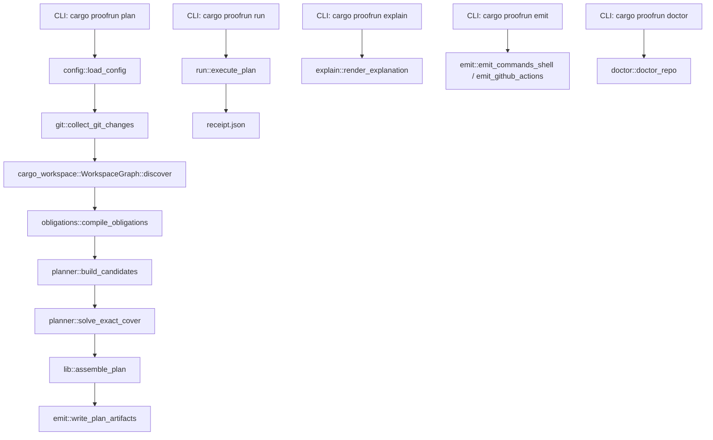
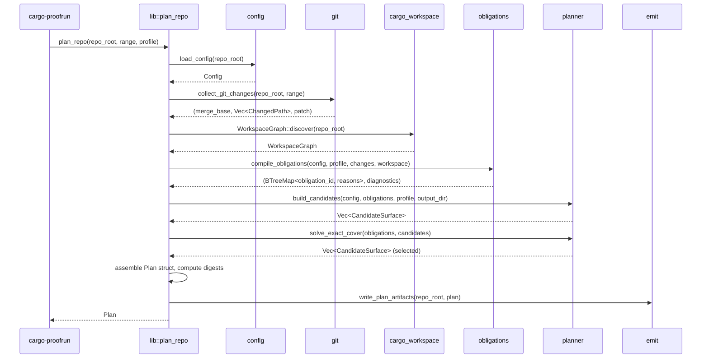

# Design Document: Rust Native Planner

## Overview

This design describes the port of `reference/proofrun_ref.py` into the existing Rust crate scaffold across `crates/proofrun` (library) and `crates/cargo-proofrun` (CLI binary). The goal is byte-identical plan and receipt artifacts for the same inputs, preserving deterministic fail-closed semantics.

The Rust implementation reuses the module stubs already in place — `cargo_workspace.rs`, `config.rs`, `git.rs`, `obligations.rs`, `planner.rs`, `emit.rs`, `explain.rs`, `run.rs`, `doctor.rs`, `model.rs` — and fills each with logic ported directly from the reference. The Python reference stays as the oracle: fixture-based conformance tests compare Rust output against recorded sample artifacts.

### Key Design Decisions

1. **`cargo metadata` over manual manifest walking**: The reference walks the filesystem and parses `Cargo.toml` files manually. The Rust port uses `cargo metadata --format-version 1` for workspace discovery, which is more robust and handles edge cases (virtual manifests, path overrides) that manual walking misses. The output is normalized to match the reference's `Package` shape.

2. **Pure-function planning core**: All modules from `config.rs` through `planner.rs` are pure functions over data. Side effects (git subprocess calls, filesystem writes) are isolated to `git.rs`, `cargo_workspace.rs`, `emit.rs`, and `run.rs`.

3. **`BTreeMap`/`BTreeSet` everywhere**: Deterministic iteration order is critical for digest stability. All maps and sets use `BTree` variants, never `HashMap`/`HashSet`.

4. **Regex-based glob matching**: The reference's `glob_to_regex` is ported directly. The `fnmatch`-style matching for cover patterns uses a separate simpler matcher that handles only `*` wildcards (matching the Python `fnmatch.fnmatch` behavior on obligation id strings).

5. **Canonical JSON via `serde_json`**: Digest computation uses a custom serializer that produces sorted-key, no-whitespace JSON matching the reference's `canonical_json`. Human-readable `plan.json` uses `serde_json` with `to_string_pretty` plus sorted keys.

## Architecture

### Pipeline



### Module Responsibilities

| Module | Responsibility | Pure? |
|---|---|---|
| `config.rs` | Parse `proofrun.toml`, provide defaults | Yes |
| `git.rs` | Shell out to `git`, parse name-status, capture patch | No (subprocess) |
| `cargo_workspace.rs` | Shell out to `cargo metadata`, build `WorkspaceGraph` | No (subprocess) |
| `model.rs` | All data types: `Plan`, `Receipt`, `ChangedPath`, etc. | Yes (types only) |
| `obligations.rs` | Glob matching, owner resolution, rule evaluation, obligation derivation | Yes |
| `planner.rs` | Candidate expansion, fnmatch cover matching, branch-and-bound solver | Yes |
| `emit.rs` | Write `plan.json`, `plan.md`, `commands.sh`, `github-actions.yml` | No (filesystem) |
| `explain.rs` | Render plan as Markdown string | Yes |
| `run.rs` | Execute or dry-run a plan, write receipt and logs | No (subprocess + filesystem) |
| `doctor.rs` | Check repo readiness, report issues | No (filesystem) |
| `lib.rs` | Top-level `plan_repo` orchestrator, re-exports | Orchestrator |

### Data Flow



## Components and Interfaces

### `config.rs` — Config Loading

```rust
pub struct Config {
    pub version: u32,
    pub defaults: Defaults,
    pub profiles: BTreeMap<String, Profile>,
    pub surfaces: Vec<SurfaceTemplate>,
    pub rules: Vec<Rule>,
    pub unknown: UnknownConfig,
}

pub fn load_config(repo_root: &Utf8Path) -> Result<Config>;
```

The existing struct is adequate. The `load_config` function reads `proofrun.toml` or falls back to a built-in default config string (matching `DEFAULT_CONFIG_TOML` in the reference). Deserialization uses `toml::from_str`. Default values are applied via serde defaults.

### `git.rs` — Git Adapter

The current stub returns `Vec<GitChange>` but the reference returns a 3-tuple: `(merge_base, changes, patch)`. The interface changes to:

```rust
pub struct GitRange {
    pub base: String,
    pub head: String,
}

pub struct GitChanges {
    pub merge_base: String,
    pub changes: Vec<ChangedPath>,  // uses model::ChangedPath directly
    pub patch: String,
}

pub fn collect_git_changes(repo_root: &Utf8Path, range: &GitRange) -> Result<GitChanges>;
```

Internally:
1. `git merge-base <base> <head>` → `merge_base`
2. `git diff --name-status <merge_base> <head>` → parse lines into `ChangedPath` (handling R/C status by taking destination path, normalizing status to single letter)
3. `git diff --binary <merge_base> <head>` → `patch` string

The `ChangedPath.owner` field is initially `None`; ownership is resolved later in `obligations.rs`.

### `cargo_workspace.rs` — Workspace Discovery

```rust
pub struct PackageInfo {
    pub name: String,
    pub dir: Utf8PathBuf,
    pub manifest: Utf8PathBuf,
    pub dependencies: Vec<String>,
}

pub struct WorkspaceGraph {
    pub packages: Vec<PackageInfo>,
    pub reverse_deps: BTreeMap<String, Vec<String>>,
}

impl WorkspaceGraph {
    pub fn discover(repo_root: &Utf8Path) -> Result<Self>;
    pub fn owner_for_path(&self, path: &str) -> Option<&str>;
}
```

`discover` invokes `cargo metadata --format-version 1 --no-deps --manifest-path <repo_root>/Cargo.toml`, parses the JSON output, and extracts workspace members. For each package:
- `name` from the metadata package name
- `dir` as the package manifest parent relative to `workspace_root`
- `manifest` as the manifest path relative to `workspace_root`
- `dependencies` filtered to only workspace-local packages (those whose id appears in the workspace members list)

Reverse dependencies are computed by inverting the dependency graph: for each package, collect all packages that list it as a dependency, sorted alphabetically.

`owner_for_path` implements longest-prefix matching: for each package, check if the normalized path starts with the package's `dir` prefix. Return the package with the longest matching prefix, or `None`.

### `obligations.rs` — Obligation Compiler

```rust
pub fn compile_obligations(
    config: &Config,
    profile: &str,
    changes: &mut [ChangedPath],
    workspace: &WorkspaceGraph,
) -> (BTreeMap<String, Vec<ObligationReason>>, Vec<String>);
```

Takes mutable `changes` so it can set `owner` on each `ChangedPath` during processing (matching the reference's `object.__setattr__` pattern).

Algorithm (direct port of `derive_obligations`):
1. For each changed path, resolve owner via `workspace.owner_for_path`
2. For each rule (1-indexed), check if any pattern matches the path using `glob_to_regex`
3. For each matching rule's emit templates:
   - If template contains `{owner}` and path is unowned: record diagnostic, emit fallback obligations if fail-closed
   - Otherwise: expand `{owner}` and add obligation with reason
4. Add profile `always` obligations
5. If no obligations and fail-closed: add empty-range fallback obligations

#### Glob-to-Regex Engine

Direct port of the reference's `glob_to_regex`:

```rust
pub fn glob_to_regex(pattern: &str) -> Regex;
pub fn match_path(path: &str, pattern: &str) -> bool;
```

Translation rules:
- `**/` → `(?:.*/)?` (zero or more directory prefixes)
- `**` (at end) → `.*` (any suffix)
- `*` → `[^/]*` (segment wildcard)
- `?` → `[^/]` (single non-separator char)
- All other characters → `regex::escape`
- Anchored with `^` and `$`

Both path and pattern are stripped of leading `/` before matching.

#### Template Expansion

```rust
pub fn expand_template(template: &str, values: &BTreeMap<String, String>) -> Result<String>;
```

Replaces `{key}` placeholders using regex `\{([A-Za-z0-9_.-]+)\}`. Errors on missing keys.

### `planner.rs` — Candidate Expansion and Solver

```rust
pub struct CandidateSurface {
    pub id: String,
    pub template: String,
    pub cost: f64,
    pub covers: Vec<String>,  // sorted
    pub run: Vec<String>,
}

pub fn build_candidates(
    config: &Config,
    obligations: &[String],
    profile: &str,
    output_dir: &Utf8Path,
) -> Vec<CandidateSurface>;

pub fn solve_exact_cover(
    obligations: &[String],
    candidates: &[CandidateSurface],
) -> Result<Vec<CandidateSurface>>;
```

#### Candidate Expansion (port of `build_candidates`)

1. Compute bindings: `[{}]` plus `[{pkg: name}]` for each distinct package in `pkg:*` obligations
2. For each surface template:
   - Determine if template uses `{pkg}` (check id, covers, run strings)
   - Select active bindings: pkg-bearing bindings if template uses `{pkg}`, else `[{}]`
   - For each binding, expand cover patterns, match against obligations using `fnmatch`-style matching
   - Build `CandidateSurface` with expanded id, covers, run
3. Deduplicate by `(id, covers)` tuple, keeping last
4. Sort by `(cost asc, -covers.len(), id asc)`

The `fnmatch`-style matching for cover patterns (e.g., `pkg:*:tests` matching `pkg:core:tests`) uses a simple glob matcher where `*` matches any substring — this matches Python's `fnmatch.fnmatch` behavior on non-path strings.

#### Branch-and-Bound Solver (port of `solve_exact_cover`)

```
solve_exact_cover(obligations, candidates):
    build obligation→candidates index
    check all obligations are coverable
    
    recurse(remaining, chosen, chosen_ids, cost):
        if remaining is empty:
            update best if (cost, len, sorted_ids) < best
            return
        prune if (cost, len) >= best[:2]
        
        target = min(remaining, key=(coverage_count, alphabetical))
        for candidate covering target, sorted by (cost, -covers.len, id):
            if candidate.id in chosen_ids: skip
            recurse(remaining - candidate.covers, chosen + [candidate], ...)
    
    return best sorted by id
```

This is a direct translation. The comparison tuple `(cost, count, signature)` ensures deterministic tie-breaking.

### `emit.rs` — Artifact Writers

```rust
pub fn write_plan_artifacts(repo_root: &Utf8Path, plan: &Plan) -> Result<()>;
pub fn emit_plan_markdown(plan: &Plan) -> String;
pub fn emit_commands_shell(plan: &Plan) -> String;
pub fn emit_github_actions(plan: &Plan) -> String;
```

`write_plan_artifacts`:
1. Create output directory
2. Write `diff.patch` (already written during git collection, but path recorded in artifacts)
3. Write `plan.json` via `serde_json::to_string_pretty` with sorted keys + trailing newline
4. Write `plan.md` via `emit_plan_markdown`
5. Write `commands.sh` via `emit_commands_shell`, set executable permission
6. Write `github-actions.yml` via `emit_github_actions`

The `plan.json` serialization must produce sorted keys. Since `serde_json` doesn't sort struct fields by default, the plan is serialized through `serde_json::Value` (which uses `Map<String, Value>` backed by `BTreeMap` when the `preserve_order` feature is NOT enabled, giving sorted keys).

#### Shell Escaping

The `shell_join` function in the existing `emit.rs` is close but needs to match the reference's `shlex.join` behavior exactly. The reference uses Python's `shlex.join` which wraps arguments in single quotes when they contain special characters. The Rust implementation uses a compatible escaping strategy.

### `explain.rs` — Markdown Renderer

The current stub is incomplete. It must match the reference's `plan_markdown` function exactly:

```
# proofrun plan

- range: `{base}..{head}`
- merge base: `{merge_base}`
- profile: `{profile}`
- plan digest: `{plan_digest}`

## Changed paths

- `{status}` `{path}` → `{owner|unowned}`

## Obligations

- `{id}`
  - source={source}, path={path}, rule={rule}, pattern={pattern}

## Selected surfaces

- `{id}` — cost `{cost}`
  - covers: {covers joined}
  - run: `{shell_join(run)}`

## Diagnostics (if any)

- {diagnostic}
```

### `run.rs` — Execution Engine

```rust
pub enum ExecutionMode { Execute, DryRun }

pub fn execute_plan(
    repo_root: &Utf8Path,
    plan: &Plan,
    mode: ExecutionMode,
) -> Result<Receipt>;
```

For dry-run: create empty log files, record each step with exit_code=0, duration_ms=0, status="dry-run".
For real execution: spawn each command as a subprocess in `repo_root`, capture stdout/stderr to log files, measure elapsed time, stop on first non-zero exit.

Log file naming: `{index:02}-{surface_id}.stdout.log` / `.stderr.log` with 1-based index.

### `doctor.rs` — Diagnostic Command

The current stub is incomplete. It must match the reference's `doctor` output shape:

```rust
pub struct DoctorReport {
    pub repo_root: String,
    pub config_path: String,
    pub cargo_manifest_path: String,
    pub package_count: usize,
    pub packages: Vec<String>,
    pub issues: Vec<String>,
}

pub fn doctor_repo(repo_root: &Utf8Path) -> DoctorReport;
```

Checks: missing `Cargo.toml`, missing `proofrun.toml`, no packages, no profiles, no surfaces, no rules.

### `lib.rs` — Orchestrator

```rust
pub fn plan_repo(repo_root: &Utf8Path, range: GitRange, profile: &str) -> Result<Plan>;
```

Orchestrates the full pipeline:
1. `load_config`
2. `collect_git_changes` → write `diff.patch`
3. `WorkspaceGraph::discover`
4. `compile_obligations`
5. `build_candidates`
6. `solve_exact_cover`
7. Assemble `Plan` struct with all fields
8. Compute `config_digest` and `plan_digest`
9. `write_plan_artifacts`
10. Return `Plan`

### `cargo-proofrun/src/main.rs` — CLI

The existing CLI is missing `emit` and `run` subcommands. The full command surface:

```rust
enum Command {
    Plan { base, head, profile, repo },
    Explain { plan },
    Emit { emit_kind: EmitKind, plan },
    Run { plan, dry_run },
    Doctor { repo },
}

enum EmitKind { Shell, GithubActions }
```

### Digest Computation

```rust
pub fn canonical_json(value: &serde_json::Value) -> String;
pub fn sha256_hex(text: &str) -> String;
```

`canonical_json` produces sorted-key, no-whitespace JSON matching the reference's `json.dumps(data, ensure_ascii=False, sort_keys=True, separators=(",", ":"))`. This is implemented by recursively walking a `serde_json::Value` and emitting keys in sorted order with `,` and `:` separators.

`sha256_hex` computes `SHA-256` of the UTF-8 bytes and returns the lowercase hex digest.

## Data Models

### Core Types (in `model.rs`)

```rust
// Already defined and adequate:
pub struct ChangedPath { path, status, owner: Option<String> }
pub struct ObligationReason { source, path: Option, rule: Option, pattern: Option }
pub struct ObligationRecord { id, reasons: Vec<ObligationReason> }
pub struct SelectedSurface { id, template, cost: f64, covers: Vec, run: Vec }
pub struct OmittedSurface { id, reason }
pub struct PlanArtifacts { output_dir, diff_patch, plan_json, plan_markdown, commands_shell, github_actions }

// Plan needs additional fields:
pub struct Plan {
    pub version: String,
    pub created_at: String,
    pub repo_root: String,
    pub base: String,
    pub head: String,
    pub merge_base: String,
    pub profile: String,
    pub config_digest: String,
    pub plan_digest: String,
    pub artifacts: PlanArtifacts,
    pub workspace: WorkspaceInfo,        // NEW
    pub changed_paths: Vec<ChangedPath>,
    pub obligations: Vec<ObligationRecord>,
    pub selected_surfaces: Vec<SelectedSurface>,
    pub omitted_surfaces: Vec<OmittedSurface>,
    pub diagnostics: Vec<String>,        // NEW
}

pub struct WorkspaceInfo {
    pub packages: Vec<WorkspacePackage>,
}

pub struct WorkspacePackage {
    pub name: String,
    pub dir: String,
    pub manifest: String,
    pub dependencies: Vec<String>,
    pub reverse_dependencies: Vec<String>,
}

pub struct Receipt {
    pub version: String,
    pub executed_at: String,
    pub plan_digest: String,
    pub status: String,  // "passed" | "failed" | "dry-run"
    pub steps: Vec<ReceiptStep>,
}

pub struct ReceiptStep {
    pub id: String,
    pub argv: Vec<String>,
    pub exit_code: i32,
    pub duration_ms: u64,
    pub stdout_path: String,
    pub stderr_path: String,
}
```

### Config Types (in `config.rs`)

Already defined and adequate. The `Config` struct maps directly to `proofrun.toml` via serde.

### Internal Types

```rust
// In planner.rs
pub struct CandidateSurface {
    pub id: String,
    pub template: String,
    pub cost: f64,
    pub covers: Vec<String>,
    pub run: Vec<String>,
}

// In cargo_workspace.rs
pub struct PackageInfo {
    pub name: String,
    pub dir: Utf8PathBuf,
    pub manifest: Utf8PathBuf,
    pub dependencies: Vec<String>,
}

pub struct WorkspaceGraph {
    pub packages: Vec<PackageInfo>,
    pub reverse_deps: BTreeMap<String, Vec<String>>,
}

// In git.rs
pub struct GitRange { pub base: String, pub head: String }
pub struct GitChanges {
    pub merge_base: String,
    pub changes: Vec<ChangedPath>,
    pub patch: String,
}
```

### Serialization Notes

- `plan.json` and `receipt.json` use `serde_json::to_string_pretty` with sorted keys (via `serde_json::Value` with `BTreeMap` backing) + trailing newline
- Canonical JSON for digests uses custom no-whitespace sorted-key serialization
- All `f64` costs serialize as `13.0` not `13` (matching Python's `json.dumps` behavior for floats) — serde_json handles this correctly since the source type is `f64`
- `null` values in `ObligationReason` fields serialize as JSON `null` (matching the reference)

## Correctness Properties

*A property is a characteristic or behavior that should hold true across all valid executions of a system — essentially, a formal statement about what the system should do. Properties serve as the bridge between human-readable specifications and machine-verifiable correctness guarantees.*

### Property 1: Glob-to-regex parity with reference

*For any* path string and glob pattern string (both composed of alphanumeric characters, `/`, `.`, `*`, `?`, and `_`), the Rust `match_path(path, pattern)` function SHALL return the same boolean result as the Python reference `match_path(path, pattern)` function.

**Validates: Requirements 3.1, 3.5**

### Property 2: Reverse dependency graph is the inverse of the dependency graph

*For any* `WorkspaceGraph` with a set of packages and their dependency lists, package B appears in `reverse_deps[A]` if and only if A appears in `dependencies[B]`. Additionally, each reverse dependency list is sorted alphabetically.

**Validates: Requirements 1.3**

### Property 3: Owner resolution selects longest prefix

*For any* set of packages with distinct directory prefixes and any file path, `owner_for_path` returns the package whose normalized directory is the longest prefix of the normalized path, or `None` if no package directory is a prefix.

**Validates: Requirements 5.1**

### Property 4: Obligation compiler produces correct obligations with reasons

*For any* valid Config, profile name, set of changed paths with known owners, and WorkspaceGraph, the obligation compiler SHALL: (a) emit an obligation for each rule-match + emit-template expansion with source `"rule"`, (b) include all profile `always` obligations with source `"profile"`, and (c) associate each obligation with a non-empty reasons list containing the correct source, path, rule index, and matched pattern.

**Validates: Requirements 4.1, 4.4, 4.6**

### Property 5: Candidate expansion produces correct bindings and covers

*For any* set of surface templates, obligation list, and profile, `build_candidates` SHALL: (a) expand `{pkg}`-bearing templates once per distinct package from `pkg:*` obligations, (b) expand non-`{pkg}` templates exactly once, (c) produce candidate ids matching `template[pkg=name]` or `template` format, (d) substitute all `{profile}` and `{artifacts.diff_patch}` placeholders in run arguments, and (e) compute each candidate's covers as exactly the obligations matching its expanded cover patterns via fnmatch-style globbing.

**Validates: Requirements 6.1, 6.2, 6.3, 6.4, 6.6**

### Property 6: Candidate list invariants

*For any* output of `build_candidates`, (a) every candidate has a non-empty covers list, (b) no two candidates share the same `(id, covers)` tuple, and (c) the list is sorted by `(cost ascending, covers count descending, id ascending)`.

**Validates: Requirements 6.5, 6.7, 6.8**

### Property 7: Solver finds minimum-cost complete cover

*For any* set of obligations and candidate surfaces where every obligation is coverable, `solve_exact_cover` SHALL return a set of candidates that (a) covers every obligation, (b) has minimum total cost among all valid covers, (c) among equal-cost solutions prefers fewer surfaces then lexicographic id sort, and (d) is sorted by id ascending.

**Validates: Requirements 7.1, 7.6, 7.7**

### Property 8: Plan digest determinism

*For any* Plan, (a) `config_digest` equals `sha256(canonical_json(config))`, (b) `plan_digest` equals `sha256(canonical_json(plan_without_plan_digest))`, and (c) `canonical_json` produces sorted keys with no whitespace separators such that `canonical_json(parse(canonical_json(x))) == canonical_json(x)`.

**Validates: Requirements 8.3, 8.4, 16.2**

### Property 9: Plan collections are sorted

*For any* Plan, `changed_paths` is sorted by `(path, status)`, `obligations` is sorted by `id`, `selected_surfaces` is sorted by `id`, and `omitted_surfaces` is sorted by `id`.

**Validates: Requirements 8.6, 16.1**

### Property 10: Markdown emitter contains all plan data

*For any* Plan, `emit_plan_markdown` produces output containing: the base..head range, merge_base, profile, plan_digest, every changed path with status and owner, every obligation id with its reasons, every selected surface with cost and shell-joined run command, and a Diagnostics section if and only if diagnostics is non-empty.

**Validates: Requirements 9.1**

### Property 11: Shell emitter structure

*For any* Plan with N selected surfaces, `emit_commands_shell` produces a string that (a) starts with `#!/usr/bin/env bash\nset -euo pipefail\n`, (b) contains exactly N comment-command blocks where each comment is `# {surface_id}` followed by the shell-escaped command, and (c) ends with a single trailing newline.

**Validates: Requirements 10.1, 10.2, 10.3**

### Property 12: GitHub Actions emitter structure

*For any* Plan with N selected surfaces, `emit_github_actions` produces a string that (a) starts with `steps:\n  - name: Execute proof plan\n    run: |\n`, (b) contains exactly N indented command lines, and (c) ends with a single trailing newline.

**Validates: Requirements 11.1, 11.2**

### Property 13: Dry-run receipt invariants

*For any* Plan executed in dry-run mode, the resulting Receipt SHALL have (a) status `"dry-run"`, (b) one step per selected surface with exit_code 0 and duration_ms 0, (c) log file paths matching `{index:02}-{surface_id}.{stdout|stderr}.log` with 1-based indexing, (d) `plan_digest` equal to the input plan's `plan_digest`, and (e) well-formed JSON with sorted keys and trailing newline.

**Validates: Requirements 12.1, 12.6, 12.7, 12.8**

### Property 14: Fixture parity with reference implementation

*For all* fixture scenarios in `fixtures/demo-workspace`, the Rust planner SHALL produce `plan.json` with identical `obligations`, `selected_surfaces`, `omitted_surfaces`, `changed_paths`, and `workspace` fields, and identical `plan.md`, `commands.sh`, and `github-actions.yml` content, and identical dry-run `receipt.json` structure (status, step count, step ids, exit codes) compared to the recorded reference output.

**Validates: Requirements 15.1, 15.2, 15.3**

### Property 15: Timestamp format

*For any* timestamp produced by the Planner or Execution_Engine, the string SHALL match the ISO 8601 pattern `YYYY-MM-DDTHH:MM:SSZ` (UTC, second precision, no fractional seconds, `Z` suffix).

**Validates: Requirements 16.3**

### Property 16: Git name-status parsing

*For any* well-formed `git diff --name-status` output line (status character(s) followed by tab-separated path(s)), the parser SHALL extract the correct status and path, using the destination path for R/C statuses and normalizing the status to a single letter.

**Validates: Requirements 2.2**

## Error Handling

### Error Strategy

All fallible operations return `anyhow::Result<T>`. The library crate (`proofrun`) uses `anyhow` for error context chaining. The CLI binary catches errors at the top level and prints them to stderr with a non-zero exit code.

### Error Categories

| Category | Source | Handling |
|---|---|---|
| Config parse failure | `config.rs` | `toml::from_str` error wrapped with file path context |
| Git subprocess failure | `git.rs` | Check exit code, include stderr in error message |
| Cargo metadata failure | `cargo_workspace.rs` | Check exit code, include stderr in error message |
| Missing config file | `config.rs` | Fall back to built-in default config (not an error) |
| Uncoverable obligation | `planner.rs` | Return error identifying the obligation with no candidates |
| Solver failure | `planner.rs` | Return error if no valid cover exists |
| Template expansion failure | `obligations.rs` | Return error identifying the missing template key |
| Filesystem write failure | `emit.rs`, `run.rs` | Propagate IO error with path context |
| Plan file parse failure | CLI | `serde_json` error wrapped with file path context |

### Fail-Closed Semantics

The fail-closed behavior is not an error — it's a policy decision. When `unknown.mode == "fail-closed"`:
- Unowned paths matching `{owner}`-bearing rules emit fallback obligations (not errors)
- Empty obligation sets emit fallback obligations (not errors)
- Diagnostics are recorded in the plan but do not cause failure

The only hard errors are: uncoverable obligations (no candidate surface exists), subprocess failures, and filesystem failures.

## Testing Strategy

### Dual Testing Approach

Testing uses both unit/example tests and property-based tests:

- **Unit tests**: Verify specific examples from fixtures, edge cases (R/C status parsing, leading-slash normalization, empty inputs), error conditions (uncoverable obligations, missing config keys), and integration points (CLI argument parsing, fixture parity).
- **Property tests**: Verify universal properties across randomly generated inputs using the `proptest` crate. Each property test runs a minimum of 100 iterations.

### Property-Based Testing Configuration

- **Library**: `proptest` (the standard Rust PBT library)
- **Minimum iterations**: 100 per property (configured via `proptest::test_runner::Config`)
- **Tag format**: Each property test includes a comment referencing its design property:
  ```rust
  // Feature: rust-native-planner, Property 1: Glob-to-regex parity with reference
  ```

### Test Organization

Tests live in `crates/proofrun/tests/` as integration tests and in `#[cfg(test)] mod tests` blocks within each module for unit tests.

| Property | Module Under Test | Test Type | Generator Strategy |
|---|---|---|---|
| P1: Glob parity | `obligations.rs` | Property | Random paths (segments of `[a-z0-9_.]` joined by `/`) and patterns (segments with `*`, `**`, `?` wildcards) |
| P2: Reverse deps | `cargo_workspace.rs` | Property | Random directed graphs of 1-20 named packages |
| P3: Owner resolution | `cargo_workspace.rs` | Property | Random package directory trees and file paths |
| P4: Obligation compiler | `obligations.rs` | Property | Random configs with 1-5 rules, 1-10 changed paths, random owners |
| P5: Candidate expansion | `planner.rs` | Property | Random surface templates and obligation sets |
| P6: Candidate invariants | `planner.rs` | Property | Same as P5, verify output invariants |
| P7: Solver optimality | `planner.rs` | Property | Small random instances (3-8 obligations, 4-12 candidates), verify against brute-force |
| P8: Digest determinism | `lib.rs` | Property | Random JSON values, verify canonical_json round-trip and digest stability |
| P9: Plan sorting | `lib.rs` | Property | Random Plan structs, verify collection ordering |
| P10: Markdown emitter | `explain.rs` | Property | Random Plan structs, verify output contains all data |
| P11: Shell emitter | `emit.rs` | Property | Random Plan structs with 1-5 surfaces |
| P12: GHA emitter | `emit.rs` | Property | Random Plan structs with 1-5 surfaces |
| P13: Dry-run receipt | `run.rs` | Property | Random Plan structs, verify receipt structure |
| P14: Fixture parity | integration | Example | Fixture scenarios: core-change, docs-change |
| P15: Timestamp format | `lib.rs` | Property | Call `utc_now()` multiple times, verify regex match |
| P16: Name-status parsing | `git.rs` | Property | Random name-status lines (M/A/D/R/C + paths) |

### Fixture-Based Conformance Tests

The existing `tests/test_reference.py` tests run the Python reference against fixtures. Equivalent Rust integration tests will:
1. Run `plan_repo` against `fixtures/demo-workspace/repo` with the recorded commit ranges
2. Compare the output plan's `obligations`, `selected_surfaces`, `omitted_surfaces`, `changed_paths`, and `workspace` fields against the recorded `sample/*/plan.json`
3. Compare emitted `plan.md`, `commands.sh`, `github-actions.yml` against recorded samples
4. Run dry-run execution and compare receipt structure against recorded `receipt.json`

These are the P14 tests and serve as the primary acceptance gate for the port.

### Edge Cases Covered by Generators

The property test generators should include these edge cases in their output space:
- Rename/copy status lines in git output (R100, C100 with tab-separated old/new paths)
- Leading `/` on paths and patterns
- `**/` at start, middle, and end of patterns
- Trailing `**` patterns
- Paths with no owning package
- Empty changed path lists
- Configs with no rules, no surfaces, no profiles
- Obligations with `{owner}` where owner is None
- Candidate surfaces that cover zero obligations (should be filtered)
- Solver inputs where a single surface covers all obligations
- Plans with empty diagnostics arrays
